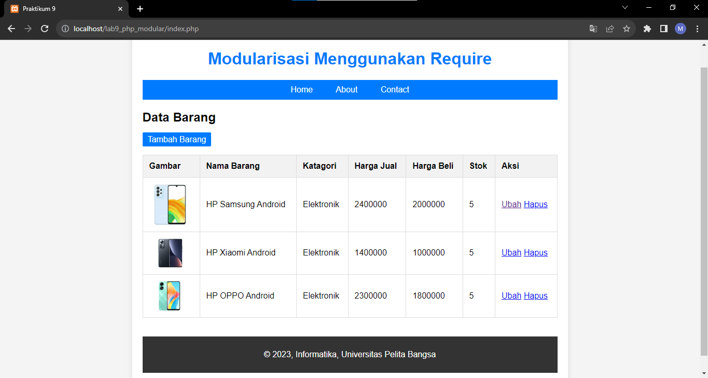
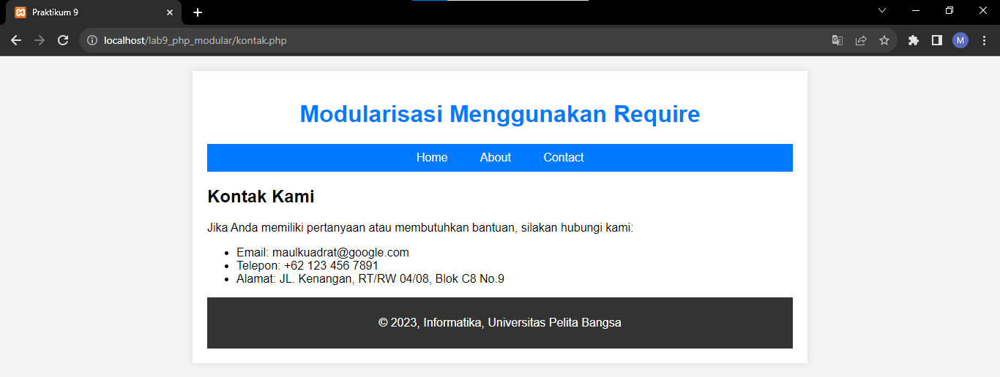
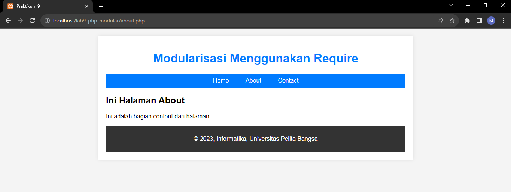

# Lab9_Web

|  |  |  |
|-----|------|-----|
|Nama|Muhammad Rizqi Maulana|
|NIM|312210360|
|Kelas|TI.22.A.4|
|Mata Kuliah|Pemograman Web|

# PHP MODULAR

## Pertanyaan dan Tugas

- Implementasikan konsep modularisasi pada kode program praktikum 8 tentang database, sehingga setiap halamannya memiliki template tampilan yang sama.

1. **header.php**

```php
<?php
include("koneksi.php");

// query untuk menampilkan data
$sql = 'SELECT * FROM data_barang';
$result = mysqli_query($conn, $sql);
?>

<!DOCTYPE html>
<html lang="en">
<head>
    <meta charset="UTF-8">
    <title>Praktikum 9</title>
    <link href="style.css" rel="stylesheet" type="text/css" />
</head>
<body>
    <div id="container">
        <header>
            <h1>Modularisasi Menggunakan Require</h1>
        </header>
        <nav>
            <a href="index.php">Home</a>
            <a href="about.php">About</a>
            <a href="kontak.php">Contact</a>
        </nav>
```

2. **footer.php**

```php
        <footer>
            <p>&copy; 2023, Informatika, Universitas Pelita Bangsa</p>
        </footer>
    </div>
</body>
</html>
```

3. **index.php**

```php
<div class="container">
    <?php require('header.php'); ?>
    <h2>Data Barang</h2>
    <a class="tambah" href="tambah.php">Tambah Barang</a>
    <div class="main">
        <table>
        <tr>
            <th>Gambar</th>
            <th>Nama Barang</th>
            <th>Katagori</th>
            <th>Harga Jual</th>
            <th>Harga Beli</th>
            <th>Stok</th>
            <th>Aksi</th>
        </tr>
        <?php if($result): ?>
        <?php while($row = mysqli_fetch_array($result)): ?>
        <tr>
            <td>" alt="<?=$row['nama'];?>"></td>
            <td><?= $row['nama'];?></td>
            <td><?= $row['kategori'];?></td>
            <td><?= $row['harga_jual'];?></td>
            <td><?= $row['harga_beli'];?></td>
            <td><?= $row['stok'];?></td>
            <td>
                <a href="ubah.php?id=<?= $row['id_barang'];?>">Ubah</a>
                <a href="hapus.php?id=<?= $row['id_barang'];?>">Hapus</a> 
            </td>
        </tr>
        <?php endwhile; else: ?>
        <tr>
            <td colspan="7">Belum ada data</td>
        </tr>
        <?php endif; ?>
        </table>
    </div>
    <br>
    <br>
    <?php require('footer.php'); ?>
</div>
```
<br>

4. **kontak.php**

```php
<div class="container">
<?php require('header.php'); ?>
    <h2>Kontak Kami</h2>
    <div class="main">
        <p>Jika Anda memiliki pertanyaan atau membutuhkan bantuan, silakan hubungi kami:</p>
        <ul>
            <li> Email: maulkuadrat@google.com</li>
            <li>Telepon: +62 123 456 7891</li>
            <li>Alamat: JL. Kenangan, RT/RW 04/08, Blok C8 No.9</li>
        </ul>
    </div>
<?php require('footer.php'); ?>
</div>
```

<br>

5. **about.php**

```php
<div class="container">
    <?php require('header.php'); ?>
    <h2>Ini Halaman About</h2>
    <p>Ini adalah bagian content dari halaman.</p>
<?php require('footer.php'); ?>
</div>
```

<br>